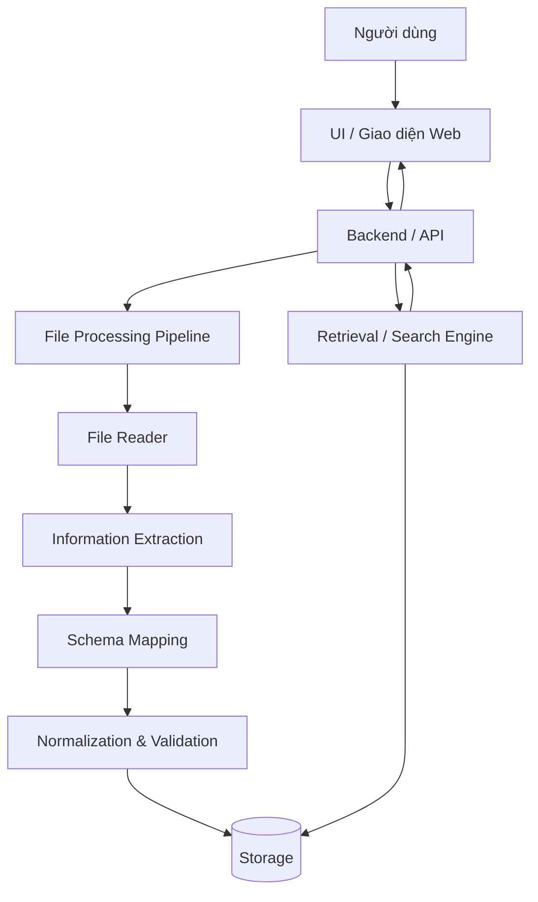
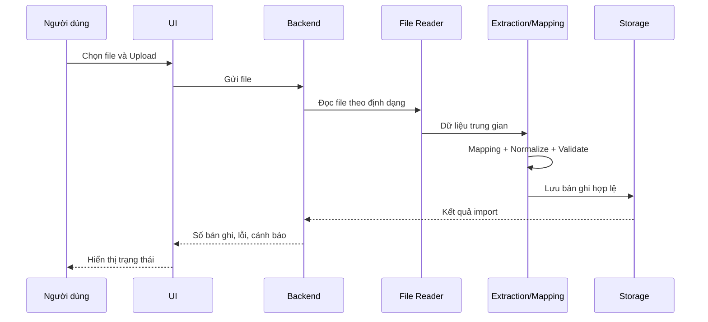
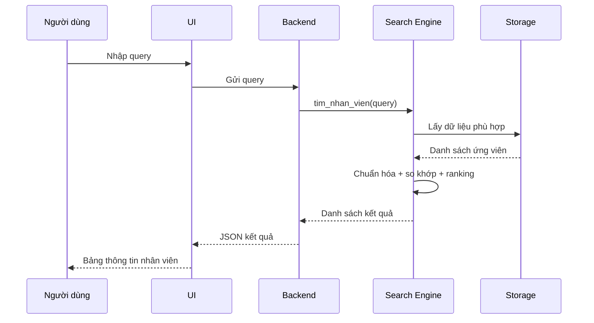
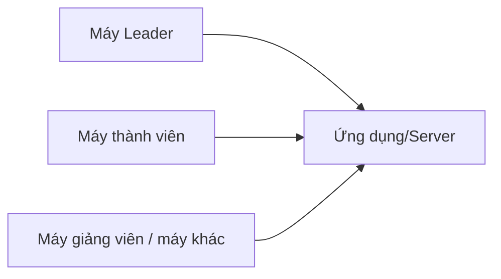

# ARCHITECTURE – Kiến trúc hệ thống truy xuất thông tin nhân viên

**Phiên bản:** 0.1 – CK1  
**Mục đích:** Là ngữ cảnh kiến trúc chung cho các task, chưa khóa cứng framework/database khi CK1 chưa review.

---

## 1. Kiến trúc logic tổng thể



Luồng upload và luồng tìm kiếm là hai luồng chính của hệ thống.

---

## 2. Luồng Upload



---

## 3. Luồng Search



---

## 4. Các thành phần chính

### 4.1. UI – User Interface (giao diện người dùng)

Trách nhiệm:

- chọn/upload file;
- hiển thị trạng thái upload;
- nhập query tìm kiếm;
- gửi yêu cầu tới backend;
- hiển thị nhiều kết quả;
- hiển thị thông báo lỗi/cảnh báo.

UI không nên tự thực hiện logic đọc PDF, mapping schema hoặc truy vấn database trực tiếp trong kiến trúc tích hợp cuối.

Framework chưa khóa. CK1-05 khảo sát Streamlit/Gradio hoặc lựa chọn phù hợp khác.

---

### 4.2. Backend / API

Trách nhiệm:

- là lớp kết nối UI với business logic;
- nhận file;
- gọi File Processing Pipeline;
- gọi Storage;
- nhận query search;
- gọi Search Engine;
- trả response có cấu trúc;
- xử lý lỗi API.

Framework chưa khóa. CK1-04 khảo sát FastAPI/Flask hoặc phương án khác.

---

### 4.3. File Reader

Trách nhiệm:

- nhận file;
- xác định định dạng;
- gọi reader phù hợp;
- đọc nội dung cơ bản;
- trả dữ liệu trung gian và metadata;
- không làm toàn ứng dụng crash khi file không hợp lệ.

Reader dự kiến:

```text
Excel Reader
CSV Reader
DOCX Reader
PDF Reader
```

PDF scan/OCR nằm ngoài yêu cầu bắt buộc CK1.

---

### 4.4. Information Extraction

**Information Extraction (trích xuất thông tin)** chuyển dữ liệu thô thành các trường có ý nghĩa.

Với file bảng, bước này có thể đơn giản là lấy header và row.

Với Word/PDF, bước này có thể cần:

- nhận diện bảng;
- nhận diện pattern `Tên trường: Giá trị`;
- rule-based extraction;
- hoặc phương pháp AI nếu sau này cần.

---

### 4.5. Schema Mapping

**Schema Mapping (ánh xạ cấu trúc)** biến tên trường khác nhau thành field chuẩn.

Ví dụ:

```text
Employee ID
Mã NV
Mã cán bộ
      ↓
ma_nhan_vien
```

CK1 sử dụng alias/rule làm baseline. AI mapping có thể được khảo sát sau nếu baseline không đủ.

---

### 4.6. Normalization & Validation

Trách nhiệm:

- chuẩn hóa khoảng trắng;
- chuẩn hóa null;
- kiểm tra trường bắt buộc;
- kiểm tra duplicate;
- chuẩn hóa email;
- giữ Unicode tiếng Việt;
- tạo danh sách record hợp lệ và record lỗi.

---

### 4.7. Storage

Storage là lớp lưu dữ liệu nhân viên.

Công nghệ chưa khóa.

Các phương án CK1-04 cần đánh giá:

- DataFrame/in-memory;
- SQLite;
- MySQL/PostgreSQL nếu thật sự cần.

Trong kiến trúc, các module khác chỉ nên phụ thuộc vào interface Storage thay vì viết logic phụ thuộc sâu vào một database cụ thể.

---

### 4.8. Retrieval / Search Engine

Trách nhiệm:

- nhận query;
- chuẩn hóa query;
- tìm exact match;
- tìm partial match;
- hỗ trợ hoa/thường;
- hỗ trợ có dấu/không dấu;
- thử fuzzy matching;
- ranking kết quả;
- trả kết quả theo schema chung.

Search Engine không phụ thuộc UI.

---

## 5. Ranh giới module

```text
UI
│ chỉ gọi Backend/API
▼
Backend
│ điều phối
├── File Processing
├── Search Engine
└── Storage

File Processing
├── Reader
├── Extraction
├── Mapping
└── Normalization

Search Engine
└── sử dụng dữ liệu từ Storage
```

Nguyên tắc quan trọng: không để mỗi module tự đọc file, tự đặt schema và tự truy vấn theo cách riêng.

---

## 6. Kiến trúc theo chu kỳ

### CK1 – Prototype độc lập có chuẩn chung

```text
                 CK1-01
        Requirements + Schema
                 │
       ┌─────────┼─────────┐
       ↓         ↓         ↓
    CK1-02    CK1-03    CK1-04
    Reader     Search    DB/API
       │         │         │
       └─────────┼─────────┘
                 ↓
              CK1-05
              UI mẫu
```

CK1-02 đến CK1-05 có thể làm song song, nhưng phải nhận Data Schema/mock data từ CK1-01.

### CK2 – Tích hợp

```text
File
 ↓
Reader + Extraction + Mapping + Normalize
 ↓
Storage
 ↓
Search Engine
 ↓
Backend
 ↓
UI
```

Mục tiêu CK2: luồng end-to-end chạy được.

### CK3 – Hoàn thiện

```text
Hệ thống CK2
   ├── Test
   ├── Sửa lỗi
   ├── Packaging
   ├── Server deployment
   ├── Technical report
   ├── User Guide
   └── Rehearsal
```

---

## 7. Cấu trúc source code đề xuất

Đây là cấu trúc định hướng, có thể điều chỉnh sau review CK1:

```text
employee-information-retrieval/
│
├── data/
│   ├── mock_data.xlsx
│   └── samples/
│
├── docs/
│   ├── requirements.md
│   ├── data_schema.md
│   ├── architecture.md
│   └── integration_rules.md
│
├── src/
│   ├── readers/
│   ├── extraction/
│   ├── normalization/
│   ├── search/
│   ├── storage/
│   ├── backend/
│   └── ui/
│
├── tests/
│   ├── sample_files/
│   ├── test_readers/
│   ├── test_search/
│   ├── test_storage/
│   └── test_integration/
│
├── app.py
├── requirements.txt
├── README.md
└── .gitignore
```

---

## 8. Deployment – mô hình demo



Máy leader chạy ứng dụng bằng địa chỉ host phù hợp, ví dụ `0.0.0.0`, sau đó máy khác trong mạng phù hợp truy cập IP và port của server.

Chi tiết triển khai được quyết định ở CK3 và ghi trong tài liệu deployment.

---

## 9. Observability – log và thông báo

MVP chưa cần hệ thống giám sát phức tạp, nhưng nên ghi log tối thiểu cho:

- file upload;
- định dạng file;
- số bản ghi đọc được;
- số bản ghi hợp lệ/lỗi;
- lỗi parser;
- lỗi database;
- lỗi search;
- lỗi API.

Không log dữ liệu nhạy cảm nếu sau này dùng dữ liệu thật.

---

## 10. Security – phạm vi cơ bản

Trong demo môn học:

- không commit password/token lên GitHub;
- dùng `.env` cho secret nếu có;
- giới hạn extension upload;
- không tin tuyệt đối tên file;
- tránh thực thi nội dung file người dùng;
- dữ liệu mock không chứa thông tin thật.

Phân quyền và authentication phức tạp chưa thuộc MVP trừ khi giảng viên yêu cầu thêm.

---

## 11. Điểm mở kiến trúc

Chưa khóa:

- SQLite hay database khác;
- FastAPI/Flask hay backend khác;
- Streamlit/Gradio hay UI khác;
- Docker có bắt buộc không;
- AI nằm ở Search, Mapping, Extraction hay Natural Language Query;
- OCR PDF scan.

Các quyết định này phải được cập nhật sau review CK1, không để từng task tự khóa riêng.
