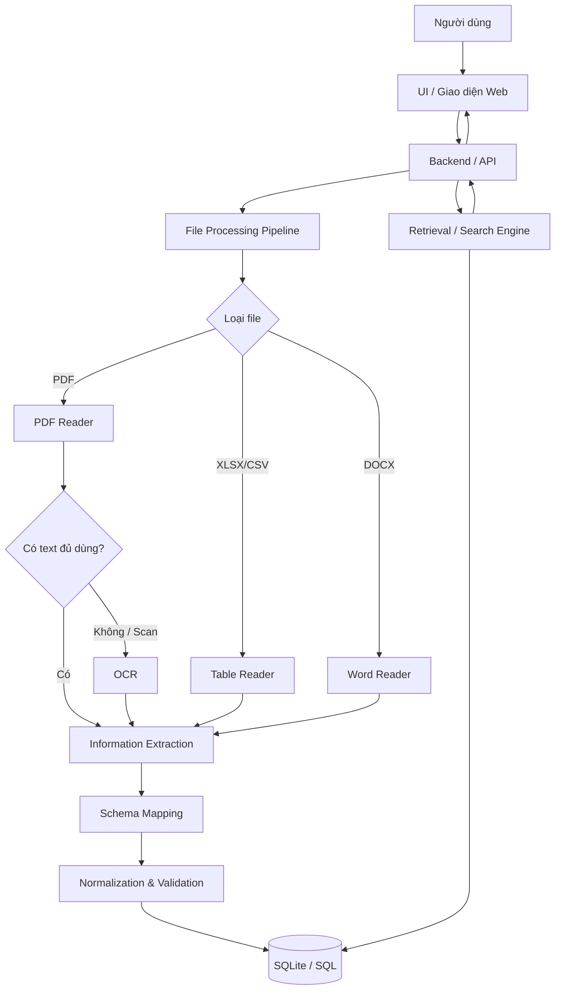

# ARCHITECTURE – Kiến trúc hệ thống truy xuất thông tin nhân viên

**Phiên bản:** 0.2 – CK1  
**Quyết định đã chốt:** Storage = SQLite/SQL; PDF scan = OCR bắt buộc.  
**Mục đích:** Là ngữ cảnh kiến trúc chung cho CK1, CK2 và CK3.

---

## 1. Kiến trúc logic tổng thể



Hệ thống có hai luồng chính:

1. **Upload/Import dữ liệu**.
2. **Search/Truy xuất dữ liệu**.

---

## 2. Luồng Upload / Import

```text
Người dùng chọn file
        ↓
UI
        ↓
Backend nhận file
        ↓
Xác định định dạng
        ↓
┌───────────────┬───────────────┬─────────────────────┐
│ XLSX / CSV    │ DOCX          │ PDF                 │
│ Table Reader  │ Word Reader   │ PDF Reader          │
└───────────────┴───────────────┴─────────┬───────────┘
                                          ↓
                                PDF có text đủ dùng?
                                   ↙             ↘
                                 Có              Không/scan
                                  ↓                 ↓
                               Extraction          OCR
                                                     ↓
                                                Extraction
                                          ↓
                                  Schema Mapping
                                          ↓
                               Normalization/Validation
                                          ↓
                                      SQLite
                                          ↓
                                 Backend response
                                          ↓
                                         UI
```

Kết quả upload phải trả được tối thiểu:

- tên file;
- loại file;
- có dùng OCR hay không;
- tổng số record;
- số record hợp lệ;
- số record lỗi;
- cảnh báo/lỗi chính.

---

## 3. Luồng Search

```text
Người dùng nhập query
        ↓
UI
        ↓
Backend
        ↓
Search Engine
        ↓
Chuẩn hóa query
        ↓
SQL lấy tập ứng viên
        ↓
Exact / Partial / Accent-insensitive / Fuzzy
        ↓
Ranking
        ↓
Danh sách EmployeeRecord + do_khop
        ↓
Backend JSON
        ↓
UI hiển thị nhiều kết quả
```

SQL chịu trách nhiệm lưu và truy vấn dữ liệu; Search Engine có thể dùng SQL để lấy ứng viên và Python để tính fuzzy/ranking.

---

## 4. Thành phần và trách nhiệm

### 4.1. UI / Web Interface

Trách nhiệm:

- chọn/upload file;
- hiển thị trạng thái xử lý;
- hiển thị thông tin OCR nếu cần;
- nhập query;
- gửi request tới backend;
- hiển thị nhiều kết quả;
- hiển thị lỗi/cảnh báo dễ hiểu.

UI không trực tiếp:

- đọc PDF;
- chạy OCR;
- mapping schema;
- viết SQL business logic.

### 4.2. Backend / API

Trách nhiệm:

- là cổng giao tiếp cho UI;
- nhận file;
- điều phối File Processing Pipeline;
- gọi Storage/SQLite;
- nhận query;
- gọi Search Engine;
- trả JSON có cấu trúc;
- xử lý lỗi API.

Framework backend có thể được CK1-04 chốt giữa FastAPI/Flask hoặc phương án phù hợp; việc này không thay đổi kiến trúc logic.

### 4.3. File Reader

Reader dự kiến:

```text
Excel Reader
CSV Reader
DOCX Reader
PDF Reader
```

Trách nhiệm:

- xác định định dạng;
- đọc nội dung cơ bản;
- trả text/table/metadata;
- không tự lưu database;
- không tự Search.

### 4.4. PDF Reader + OCR

Đây là một nhánh bắt buộc.

PDF Reader phải:

1. thử trích xuất text trực tiếp;
2. đánh giá text có đủ dùng hay không;
3. nếu PDF scan/không đủ text → chuyển sang OCR;
4. trả text OCR và metadata.

Luồng:

```text
PDF
 ↓
Direct Text Extraction
 ↓
Text đủ dùng?
  │
  ├── Có → Extraction
  │
  └── Không → Convert page to image → OCR → Extraction
```

OCR engine có thể thay thế, nhưng contract output phải giữ ổn định.

### 4.5. Information Extraction

Chuyển dữ liệu thô thành trường có ý nghĩa.

Với dữ liệu bảng:

- header;
- row;
- cell.

Với DOCX/PDF/OCR text:

- bảng;
- pattern `Tên trường: Giá trị`;
- dòng/khối text;
- rule-based extraction;
- có thể bổ sung AI nếu nhóm chốt sau.

### 4.6. Schema Mapping

Biến tên trường khác nhau thành field chuẩn.

```text
Employee ID
Mã NV
Mã cán bộ
      ↓
ma_nhan_vien
```

Baseline dùng alias/rule. AI-assisted mapping có thể được thêm nếu thật sự cần.

### 4.7. Normalization & Validation

Trách nhiệm:

- chuẩn hóa khoảng trắng;
- chuẩn hóa null;
- kiểm tra trường bắt buộc;
- kiểm tra duplicate;
- giữ Unicode tiếng Việt;
- tạo danh sách record hợp lệ;
- tạo danh sách record lỗi.

### 4.8. SQLite / SQL Storage

**Đã chốt:** Storage chính thức là SQLite.

Trách nhiệm:

- tạo database/schema;
- lưu EmployeeRecord;
- kiểm soát khóa chính `ma_nhan_vien`;
- truy vấn theo mã/tên/đơn vị;
- hỗ trợ transaction khi import;
- cung cấp dữ liệu cho Search Engine;
- không để UI truy cập database trực tiếp.

Database file baseline:

```text
data/employee.db
```

Có thể đổi tên/path nhưng không được hard-code đường dẫn máy cá nhân.

### 4.9. Retrieval / Search Engine

Trách nhiệm:

- nhận query;
- chuẩn hóa query;
- exact match;
- partial match;
- không phân biệt hoa/thường;
- có dấu/không dấu;
- fuzzy matching;
- ranking;
- trả kết quả theo schema chung.

Search Engine có thể kết hợp:

```text
SQL candidate retrieval
        +
Python similarity/ranking
```

---

## 5. Ranh giới module

```text
UI
│ chỉ gọi Backend/API
▼
Backend
│ điều phối
├── File Processing Pipeline
├── Search Engine
└── SQLite Storage

File Processing Pipeline
├── Reader
├── PDF OCR
├── Extraction
├── Mapping
└── Normalization

Search Engine
└── truy xuất dữ liệu qua Storage/SQL
```

Nguyên tắc: mỗi module chỉ chịu trách nhiệm phần của mình.

---

## 6. Kiến trúc theo chu kỳ

### CK1 – Prototype có chuẩn chung

```text
                    CK1-01
         Requirements + Schema + Architecture
                       │
        ┌──────────────┼───────────────┐
        ↓              ↓               ↓
     CK1-02         CK1-03          CK1-04
 Reader + OCR        Search        SQLite/API
        │              │               │
        └──────────────┼───────────────┘
                       ↓
                    CK1-05
                    UI mẫu
```

CK1-02 đến CK1-05 có thể làm song song, nhưng phải theo contract của CK1-01.

### CK2 – Tích hợp end-to-end

```text
File
 ↓
Reader / OCR
 ↓
Extraction
 ↓
Mapping
 ↓
Normalization
 ↓
SQLite
 ↓
Search Engine
 ↓
Backend
 ↓
UI
```

Mục tiêu CK2: luồng chạy được từ upload đến search result.

### CK3 – Hoàn thiện và triển khai

```text
Hệ thống CK2
   ├── Test file/OCR/SQL/Search/API/UI
   ├── Sửa lỗi
   ├── Packaging
   ├── Server deployment
   ├── Technical report
   ├── User Guide
   └── Rehearsal
```

---

## 7. Cấu trúc source code đề xuất

```text
employee-information-retrieval/
│
├── data/
│   ├── mock_data.xlsx
│   ├── employee.db
│   └── samples/
│
├── docs/
│   ├── requirements.md
│   ├── data_schema.md
│   ├── architecture.md
│   └── integration_rules.md
│
├── src/
│   ├── readers/
│   │   ├── excel_reader.py
│   │   ├── csv_reader.py
│   │   ├── word_reader.py
│   │   └── pdf_reader.py
│   │
│   ├── ocr/
│   │   └── pdf_ocr.py
│   │
│   ├── extraction/
│   ├── normalization/
│   ├── storage/
│   │   ├── database.py
│   │   └── schema.sql
│   │
│   ├── search/
│   ├── backend/
│   └── ui/
│
├── tests/
│   ├── sample_files/
│   ├── test_readers.py
│   ├── test_ocr.py
│   ├── test_storage.py
│   ├── test_search.py
│   └── test_api.py
│
├── requirements.txt
├── README.md
└── .gitignore
```

---

## 8. Mô hình triển khai

```text
                    MÁY LEADER
            ┌─────────────────────┐
            │ UI                  │
            │ Backend             │
            │ OCR                 │
            │ SQLite employee.db  │
            └──────────┬──────────┘
                       │
                 LAN / Network
            ┌──────────┼──────────┐
            ↓          ↓          ↓
          Client 1   Client 2   Client 3
          Browser    Browser    Browser
```

Máy client không cần cài Python/OCR/SQLite nếu chỉ truy cập giao diện web.

---

## 9. Điểm cần test riêng vì đã chốt OCR + SQL

### OCR

- PDF text;
- PDF scan rõ;
- PDF scan tiếng Việt;
- PDF nhiều trang;
- OCR không nhận được text;
- OCR ra text sai một phần;
- bảng trong PDF scan.

### SQL

- tạo database mới;
- import nhiều record;
- duplicate mã nhân viên;
- query theo mã;
- query theo tên;
- transaction lỗi;
- restart server nhưng dữ liệu vẫn tồn tại.

---

## 10. Thành phần AI

Thành phần AI chính vẫn chưa khóa.

OCR là một chức năng nhận dạng cần thiết cho đầu vào scan, nhưng nhóm không nên mặc định coi OCR là toàn bộ đóng góp AI của đề tài. CK1/CK2 có thể khảo sát thêm AI cho:

- schema mapping;
- information extraction;
- semantic search;
- natural-language query.

Quyết định cuối phải dựa trên khả năng triển khai và test được.
